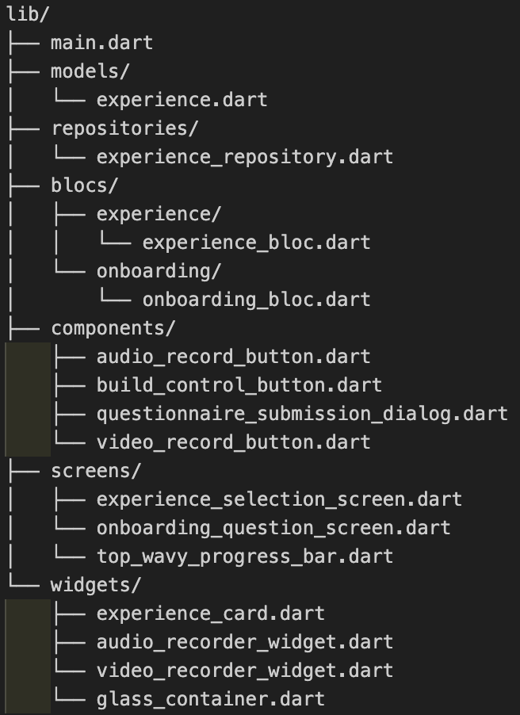

# eightclub_assignment

A new Flutter project.

## Getting Started

This is a project built using Flutter for 8Club's "Flutter Developer Intern" role
Here's the demo link for the app: https://drive.google.com/file/d/16X7evnmqzWQ7X_G2SSNtS0UljhEoF62X/view?usp=sharing

## Features and functionalities implemented

# Features

## Custom App Bar
- Created a custom top bar to display the wavy pattern.  
- Uses the screen’s width and amplitude/wavelength to draw a sine-wave-like line showing progress.  
- Currently set to 50/50 progress as there are two onboarding screens.

## Experience Selection Screen
1. Fetches experiences from API using Dio  
2. Multi-select experience cards with grayscale for unselected state and tilted card design as per Figma  
3. Multi-line text field with 250-character limit  
4. Clean, modern UI with consistent spacing and alignment  
5. State management implemented using **BLoC pattern**

## Onboarding Question Screen
1. Multi-line text field with 600-character limit  
2. Audio recording feature with waveform visualization  
3. Dynamic layout – recording buttons hide after recording starts  
4. Cancel option during recording  
5. Delete option for recorded media  
6. Animated “Next” button width adjustment  
7. Video preview available after recording (same for audio playback)  
8. Audio and video sections include **delete**, **stop**, and **cancel** controls

## Brownie points (Optional enhancements) - features implemented

# UI/UX
- Try for a pixel perfect design. Refer spacings, fonts and colors from the figma file.
- Keep the UI responsive, handle cases when the keyboard is open and viewport
height is reduced.

# State management
- Implemented a state management solution using BloC to manage state.
- Used Dio for managing the API call.

Project Structure

## Default flutter project creation stuff 
This project is a starting point for a Flutter application.

A few resources to get you started if this is your first Flutter project:

- [Lab: Write your first Flutter app](https://docs.flutter.dev/get-started/codelab)
- [Cookbook: Useful Flutter samples](https://docs.flutter.dev/cookbook)

For help getting started with Flutter development, view the
[online documentation](https://docs.flutter.dev/), which offers tutorials,
samples, guidance on mobile development, and a full API reference.
